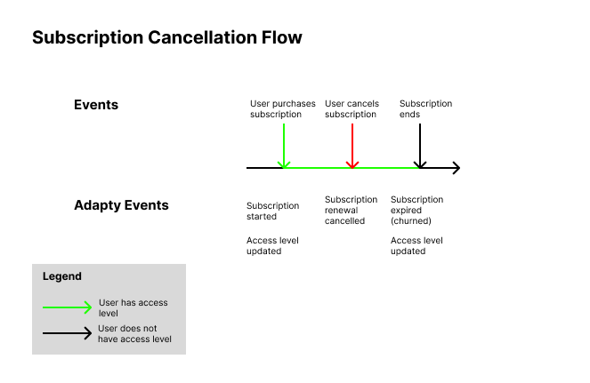
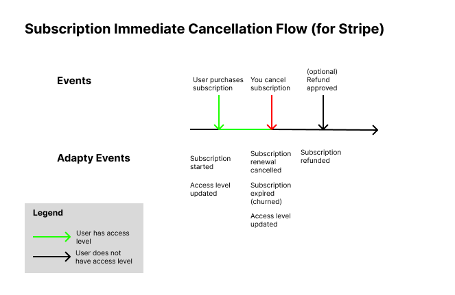
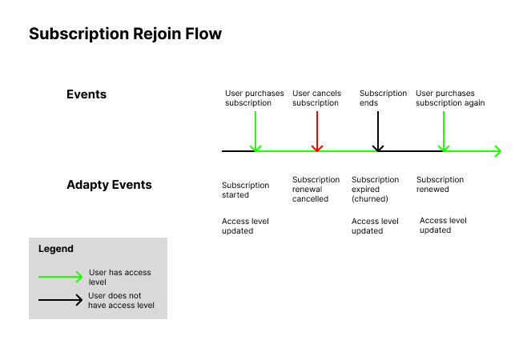
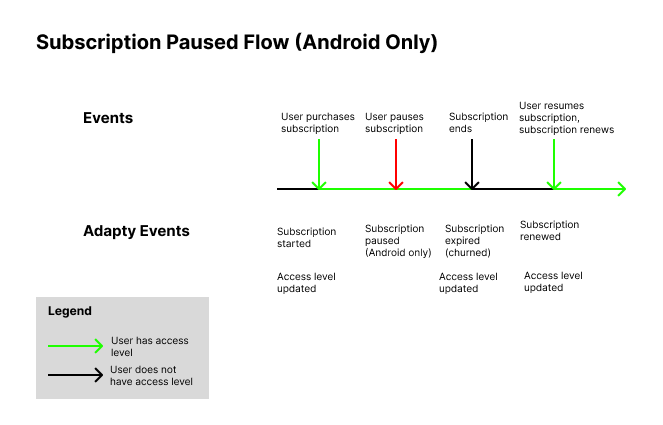
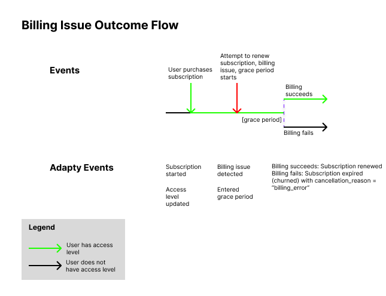
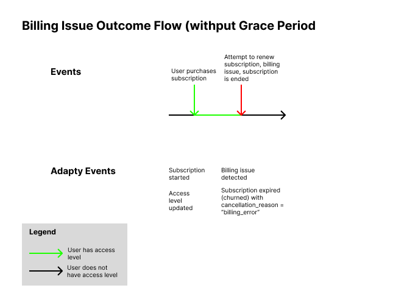
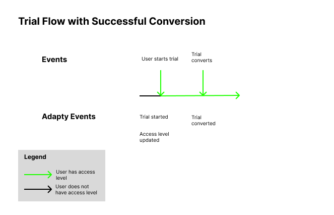
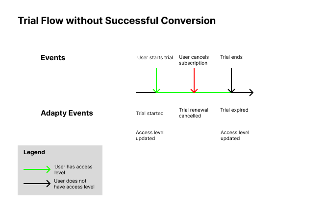
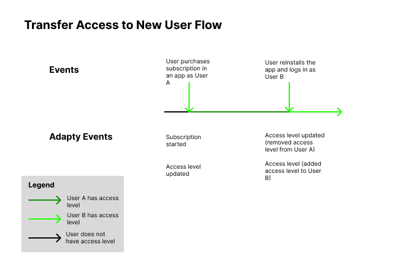
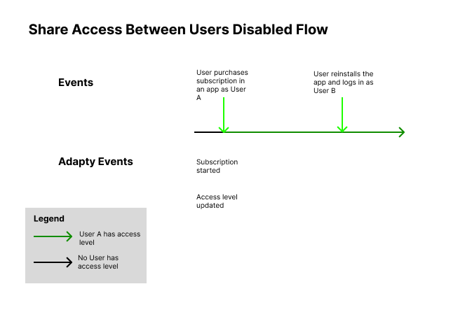

In Adapty, you'll receive various webhook events throughout a customer’s journey in your app. These subscription flows outline common scenarios to help you understand the events that Adapty generates as users subscribe, cancel, or reactivate subscriptions.

Most events are created and sent to all configured integrations if they’re enabled. However, the **Access level updated** event only triggers if a [webhook integration](webhook) is configured and this event is enabled. This event will appear in the [**Event Feed**](https://app.adapty.io/event-feed) and be sent to the webhook, but it won’t be shared with other integrations.

If a webhook integration isn’t configured or this event type isn’t enabled, the **Access level updated** event won’t be created and won’t appear in the [**Event Feed**](https://app.adapty.io/event-feed).

## Subscription Lifecycle

### Initial Purchase Flow

This flow happens when a customer buys a subscription for the first time. 

### Subscription Cancellation Flow

When a user cancels their subscription, a **Subscription renewal cancelled** event is created, which means the subscription will stay active until the end of the period. Once the subscription ends, the **Subscription expired (churned)** event is triggered, revoking access and creating an **Access level updated** event to remove the user’s access.

If a refund is approved, an additional **Subscription refunded** event occurs at that moment.

.png)

For Stripe, a subscription can be canceled immediately, skipping the remaining period. In this case, both **Subscription renewal cancelled** and **Subscription expired (churned)** events are created simultaneously. If a refund is approved, a **Subscription refunded** event is also triggered when it’s approved.

### Subscription Reactivation Flow

If a user cancels a subscription, it expires, and they later repurchase the same subscription, a **Subscription renewed** event will be created. Even if there’s a gap in access, Adapty treats this as a single transaction chain, linked by the **vendor_original_transaction_id**. So, the repurchase is considered a renewal.

### Subscription Pause Flow (Android only)

This flow applies if a user pauses and then resumes a subscription on Android.

### Billing Issue Outcome Flow

If attempts to renew a subscription fail due to a billing issue, what happens next depends on whether a grace period is enabled. 

With a grace period, if the payment succeeds, the subscription renews. If it fails, the subscription expires, and a **Subscription expired (churned)** event is created with a cancellation_reason of “billing_error.”

Without a grace period, the **Subscription expired (churned)** event is created immediately with the same cancellation reason.

## Trial Flows

If you use trials in your app, you’ll receive additional trial-related events.

### Trial with Successful Conversion Flow

The most standard flow is the trial with a suvvessful conversion, when a user starts a trial, provides a credit card and at the moment of the trial expiration, the payment is successful and the trial is converter to a standard subscription. In this situation the Trial started event creates at the moment when the user starts it and the Trial converted event is created after the pament and when the standard subscriuption starts.

In this flow, a user starts a trial with a payment method on file. A **Trial started** event is triggered when the trial begins.  If payment succeeds at the end of the trial, it's followed by a **Trial converted** event after the successful payment, marking the start of a standard subscription.

### Trial without Successful Conversion Flow

If a user cancels the trial before it converts to a subscription, a **Trial renewal cancelled** event is triggered at the time of cancellation. The user will have access until the end of the trial, when a **Trial expired** event is created, removing access.

### Trial Billing Issue Outcome Flow

If a user doesn’t cancel the trial but a billing issue occurs at the conversion point, the flow depends on the grace period. 

With a grace period, if the payment succeeds, the trial converts to a subscription (triggering **Trial converted**). If it fails, a **Trial expired** event is created with a cancellation_reason of “billing_error.”

.png)

Without a grace period, the **Trial expired** event is created immediately, and access is revoked.

.png)

### Subscription Reactivation after Expired Trial Flow

If a trial expires (due to a billing issue or cancellation) and the user later buys a subscription, a **Trial converted** event is created. Even with a gap between the trial and subscription, Adapty links the two using **vendor_original_transaction_id**. This conversion is treated as part of a continuous transaction chain, starting with a zero-price trial.

## Product Changes

This section covers any adjustments made to active subscriptions, such as upgrades, downgrades or purchases of a product from another group.

## Sharing Purchases Across User Accounts Flows

When a [Customer User ID](identifying-users#setting-customer-user-id-on-configuration) attempts to restore or extend a subscription already tied to a different [Customer User ID](identifying-users#setting-customer-user-id-on-configuration), Adapty’s **Sharing paid access between user accounts** setting controls how access is managed. The flow will vary depending on the selected option.

###  Transfer Access to New User Flow

The recommended option is to transfer the access level to the new user. This preserves the original user’s transaction history for consistent analytics.

###  Shared Access Between Users Flow

This option allows multiple users to share the same access level, though it’s a bit risky since it may lead to multiple users accessing the same content. While the access level is shared, all transactions are logged under the original Customer User ID to maintain complete transaction history and analytics.

###  Access Not Shared Between Users Flow

With this option, only the first user profile to receive the access level retains it permanently. This is ideal if purchases need to be tied to a single Customer User ID.

